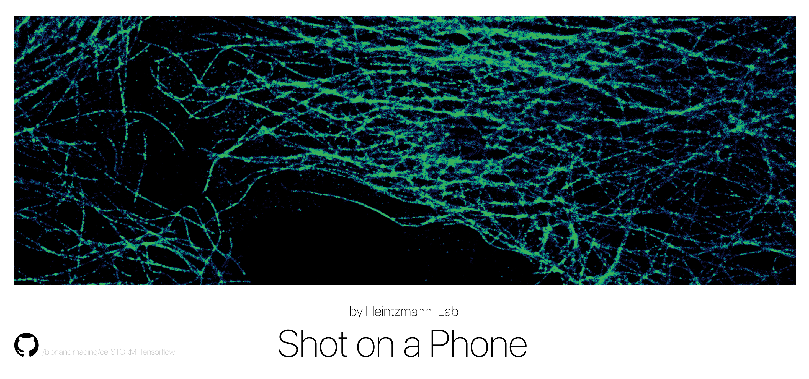

cellSTORM TENSORFLOW Files
==============================

Based on paper by Benedict Diederich, Patrick Then, Alexander Jügler, Ronny Förster, Rainer Heintzmann

[Article about the implementation of cellSTORM](https://arxiv.org/abs/1804.06244)
; Based on [pix2pix](https://phillipi.github.io/pix2pix/) by Isola et al.

## Introduction
This is the repo for the Tensorflow implementation of cellSTORM based on the conditional generative adversarial network (cGAN) implmented by pix2pix-tensoflow. In this case it learns a mapping from input images (i.e. degraded, noisy, compressed video-sequences of dSTORM blinking events) to output images (i.e. localization maps/center of possible blinking fluorophore)

The repository has also a scipt to export a given Graph trained on GPU to a cellphone. The cellSTORM localizer APP can be found in another repo.


## Setup (pix2pix related)

### Prerequisites

Prerequisites: This software was tested on a Ubuntu 16.04 LTS 64-bit operating system equipped with a NVidia TITAN X 12 GB, with the following packages:

1. Fiji with ThunderSTORM plugin 1.3 installed
2. MatlabR2016b with `dip_image` toolbox ([Details](https://github.com/bionanoimaging/cellSTORM-MATLAB))
3. Anaconda distribution 5.1 for Ubuntu (64-bit) with Tensorflow 1.8.0

### Recommended
- Linux with Tensorflow GPU edition + cuDNN

### Getting Started
Most of the steps are equivalent to Deep-Storm by Nehme et al. 2018. Please also look into their project. 

A detailed list with all dependecies will follow soon! 
See also the `environmet.yml` file

## Training
Before training, you should download the datapair files and place them into the ./data folder from our [GoogleDrive](https://drive.google.com/drive/folders/1dc1n7xVqvl5wu0Mui3TbSOfZdSqgrVZJ?usp=sharing). The code automatically looks for all `.h5`-files. 
For normal training you can just use the code below:

```
# First change into the directory where you downloaded this Repo
cd ./pix2pix-tensorflow

# Then start the training process
python pix2pix.py \
--mode train \
--batch_size 4 \
--display_freq 50 \
--ndf 32 --ngf 32 \
--beta1 0.5 --lr 0.0001 \
--output_dir test_tvreg \
--scale_size 256 \
--max_epochs 100 \
--l1_weight 100 \
--l1_sparse_weight 100 \
--save_freq 500 \
--gan_weight 1 \
--tv_weight 100

```


## Testing

Testing is done with `--mode test`.  You should specify the checkpoint to use with `--checkpoint`, this should point to the `output_dir` that you created previously with `--mode train`. The `--input_dir` states the Video-file you want to process. The ratio of `--scale_size` and `--crop_size` gives the upsampling factor. `5` worked good in our experiments. 
 
- `--is_csv=1` will produce a list of localized events. 
- `--is_frc=1` will produce two TIF-files where one sums only over even, the other over odd frames (to measure the FRC in Fiji for example)
- `--x_center` and `y_center` are set to `-1` you're asked to choose the center of the video where it gets cropped on screen.
 


```sh

# for videos - upsampling ~5
# Change the directory where you'Ve downloaded the Repo
cd /home/useradmin/Dropbox/Dokumente/Promotion/PROJECTS/STORM/PYTHON/pix2pix-tensorflow

python pix2pix.py \
--mode test \
--input_dir ./STORM/DATASET_NN/ALL_VIDEOS/MOV_2018_05_09_15_09_17_ISO3200_texp_1_30_newsample.mp4 \
--batch_size 1 \
--output_dir ./dump \
--scale_size 1792 \
--checkpoint train_overnight_1_2_3_cluster_4_GANupdaterule_synthetic \
--roi_size 360 \
--is_csv 1 \
--is_tif 0 \
--is_frc 1 \
--x_center -1 \
--y_center -1 \
--max_steps 6000 
```

The testing mode will load some of the configuration options from the checkpoint provided so you do not need to specify `which_direction` for instance.


## Citation
If you use this code for your research, please cite the paper this code is based on: <a href="https://arxiv.org/abs/1804.06244">cellSTORM - cost-effective super-resolution on a cellphone using dSTORM</a>:

```
@article{cellstorm2018,
  title={cellSTORM - cost-effective super-resolution on a cellphone using dSTORM},
  author={Benedict Diederich*, Patrick Then, Alexander Jügler, Ronny Forster, Rainer Heintzmann},
  journal={arxiv},
  year={2018}
}
```

## Acknowledgments
This is a port of [pix2pix](https://github.com/phillipi/pix2pix) from Torch to Tensorflow.  It also contains colorspace conversion code ported from Torch.  Thanks to the Tensorflow team for making such a quality library!  And special thanks to Phillip Isola for answering my questions about the pix2pix code.

Kudos to [Christopher Hesse](https://github.com/christopherhesse) for his amazing pix2pix TensorFlow implementation and [Gene Kogan](http://genekogan.com/) for his inspirational workshop. Many thanks to Ingo Fuchs for the help with the Android APP.


